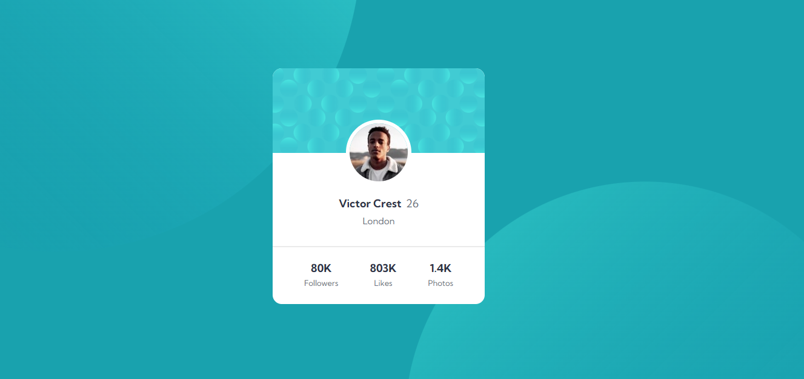

# Frontend Mentor - Profile card component solution

This is a solution to the [Profile card component challenge on Frontend Mentor](https://www.frontendmentor.io/challenges/profile-card-component-cfArpWshJ). Frontend Mentor challenges help you improve your coding skills by building realistic projects. 

## Overview

### The challenge

- Build out the project to the designs provided

Design: 

### Screenshot

Solution screenshot: 

### Links

- Solution URL: [Solution](./solution)
- Live Site URL: [Live site](https://your-live-site-url.com)

## My process

### Built with

- Semantic HTML5 markup
- CSS custom properties
- Flexbox

## Author

- LinkedIn - [Daniel Westerlund](https://www.linkedin.com/in/daniel-westerlund-a07529179/)
- Website - [GitHub Pages](https://danielw720.github.io/)
- Frontend Mentor - [@DanielW720](https://www.frontendmentor.io/profile/yourusername)